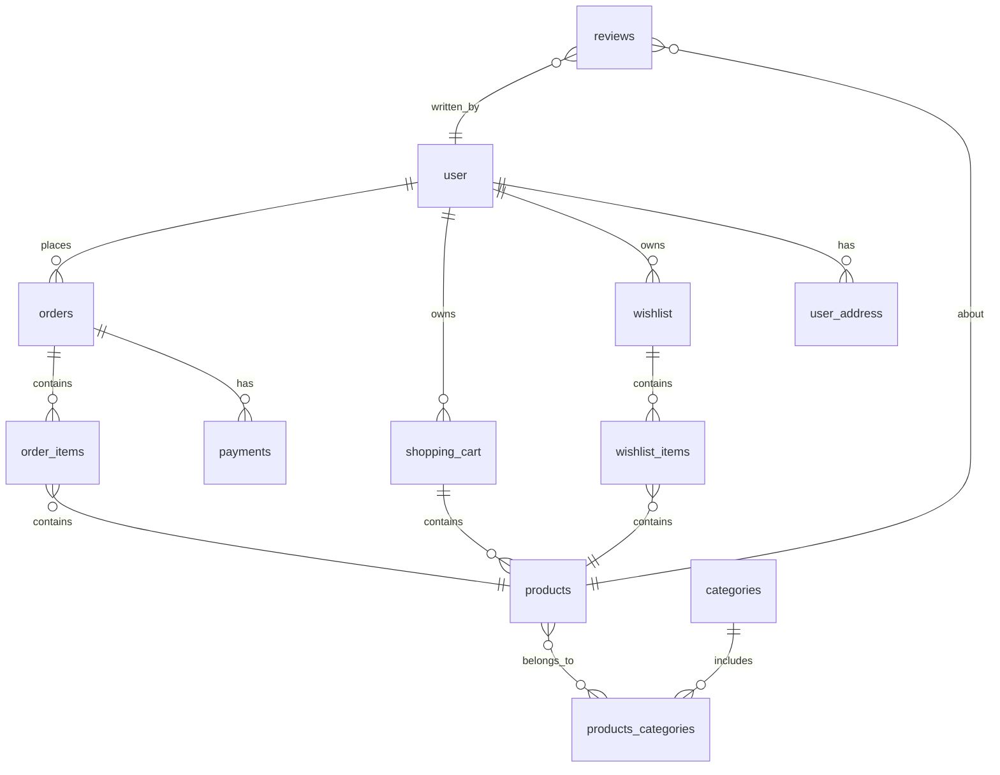

# Проект SQL practice shop db

Проект представляет собой учебную систему связанных таблиц в реляционной базе данных.  
Цель — отрабатывать навыки работы с SQL, JOIN, агрегацией, подзапросами и оконными функциями на примере интернет-магазина.

Система моделирует основные сущности интернет-магазина, включая пользователей, товары, заказы и связанные с ними данные.

---

# Оглавление

- [Проект SQL practice shop db](#проект-sql-practice-shop-db)
- [Таблицы](#таблицы)
- [Необходимая теория по SQL](#необходимая-теория-по-sql)
  - [Уровень 1 — Базовые выборки и фильтрация](#уровень-1--базовые-выборки-и-фильтрация)
  - [Уровень 2 — Агрегации и группировка](#уровень-2--агрегации-и-группировка)
  - [Уровень 3 — Работа с JOIN и агрегатами по связанным таблицам](#уровень-3--работа-с-join-и-агрегатами-по-связанным-таблицам)
  - [Уровень 4 — Подзапросы и оконные функции](#уровень-4--подзапросы-и-оконные-функции)
  - [Уровень 5 — Сложные аналитические задачи и продвинутая работа с данными](#уровень-5---сложные-аналитические-задачи-и-продвинутая-работа-с-данными)

---

## Таблицы

### Схема таблиц


[Вернуться к оглавлению](#оглавление)

### `users`
Хранит данные о пользователях магазина.  
Основные поля: `id`, `name`, `email`, `created_at`.  

### `user_address`
Содержит адреса пользователей.  
Связана с `users` через `user_id`.  
Позволяет хранить несколько адресов на одного пользователя.  

### `orders`
Хранит заказы пользователей.  
Основные поля: `id`, `user_id`, `created_at`, `status`, `total_amount`.  
Связь с `order_items` для получения позиций заказа.  

### `order_items`
Содержит позиции заказов: какие товары и в каком количестве были куплены.  
Связана с `orders` и `products`.  
Основные поля: `order_id`, `product_id`, `quantity`, `unit_price`.  

### `shopping_cart`
Временное хранение товаров, добавленных в корзину пользователем.  
Связана с `users` и `products`.  
Основные поля: `user_id`, `product_id`, `quantity`.  

### `wishlist`
Список желаемых товаров пользователя.  
Связана с `users` и `products`.  
Основные поля: `user_id`, `product_id`.  

### `reviews`
Отзывы пользователей на товары.  
Связана с `users` и `products`.  
Основные поля: `user_id`, `product_id`, `rating`, `comment`, `created_at`.  

### `products`
Хранит информацию о товарах.  
Основные поля: `id`, `name`, `price`, `description`, `created_at`.  
Связь с `categories` через `m2m_products_categories`.  

### `categories`
Категории товаров.  
Позволяют структурировать ассортимент и делать аналитические выборки по группам товаров.  
Основные поля: `id`, `name`.  

### `m2m_products_categories`
Ассоциативная таблица для связи многие-ко-многим между `products` и `categories`.  
Основные поля: `product_id`, `category_id`.  

### `payment`
Информация о платежах за заказы.  
Связана с `orders`.  
Основные поля: `id`, `order_id`, `amount`, `payment_date`, `status`.  

---

# Необходимая теория по SQL

## Уровень 1 — Базовые выборки и фильтрация
[Вернуться к оглавлению](#оглавление)
Цель
Научиться получать нужные строки и столбцы из одной таблицы, управлять фильтрацией, сортировкой и ограничением.


### Основные команды:  
- `SELECT` — выбирает данные из таблицы  
- `FROM` — указывает таблицу  
- `WHERE` — фильтрует строки  
- `ORDER BY` — сортирует результаты  
- `LIMIT` — ограничивает количество строк  
- `DISTINCT` — убирает дубликаты  

### Типовые задачи
- Получить все записи из таблицы  
- Отфильтровать по условию  
- Отсортировать по возрастанию или убыванию  
- Вывести первые N строк  

### Пример
```sql
SELECT name, price
FROM products
WHERE price > 1000
ORDER BY price DESC
LIMIT 10;
```
[Вернуться к оглавлению](#оглавление)

## Уровень 2 — Агрегации и группировка
[Вернуться к оглавлению](#оглавление)

### Теория
- `GROUP BY` — объединяет строки в группы по значению поля  
- `COUNT`, `SUM`, `AVG`, `MIN`, `MAX` — агрегатные функции  
- `HAVING` — фильтр для агрегированных данных  
- `ORDER BY` — сортировка результата после группировки  

### Типовые задачи
- Подсчитать количество заказов по пользователю  
- Найти общую сумму заказов  
- Вычислить средний чек  
- Определить максимальную или минимальную цену по категории  

### Пример
```sql
SELECT user_id, SUM(total_amount) AS total_spent
FROM orders
GROUP BY user_id
HAVING SUM(total_amount) > 10000
ORDER BY total_spent DESC;
```
[Вернуться к оглавлению](#оглавление)

## Уровень 3 — Работа с JOIN и агрегатами по связанным таблицам
[Вернуться к оглавлению](#оглавление)

### Теория
- `JOIN` / `LEFT JOIN` — объединение таблиц по связям (1:N, M:N)  

- `GROUP BY` — объединяет строки с одинаковыми значениями указанного поля или набора полей в одну группу.  
  После группировки можно применять агрегатные функции (`COUNT`, `SUM`, `AVG` и др.) для каждой группы.


- Агрегатные функции: `COUNT`, `SUM`, `AVG`, `MAX`, `MIN` — применяются к группе строк, чтобы вычислить одно значение для группы.  
  После `GROUP BY` каждая группа превращается в одну строку с вычисленным агрегатом.  
  Примеры:  
  - `COUNT(*)` — количество строк в группе  
  - `SUM(price)` — сумма значений в группе  
  - `AVG(price)` — среднее значение  
  - `MAX(price)` / `MIN(price)` — максимальное / минимальное значение

- `ORDER BY`, `LIMIT` — сортировка и ограничение выборки  

- `COALESCE()` — возвращает первое значение из списка, которое не `NULL`.  
  Используется для подстановки значения по умолчанию вместо `NULL`.  
  Пример: `COALESCE(discount, 0)` — если `discount` равен `NULL`, вернётся `0`.

- Параметризация в SQLAlchemy через `text()` с `:param` — безопасная подстановка значения в SQL-запрос.  
Пример:
```
from sqlalchemy import text

query = text("SELECT * FROM orders WHERE user_id = :user_id")
res = await session.execute(query, {"user_id": 7})
rows = res.mappings().all()
```
- ORM: `select().join().group_by().order_by()` и `func`  


### Типовые задачи
- Топ-N товаров по количеству заказов  
- Средняя цена товаров по категориям  
- Сумма заказов для конкретного пользователя  
- Подсчёт товаров по категориям  


### Пример
```sql
SELECT p.id AS product_id,
       p.name AS product_name,
       COUNT(*) AS order_count
FROM products p
JOIN order_items oi ON p.id = oi.product_id
GROUP BY p.id, p.name
ORDER BY order_count DESC
LIMIT 10;
```

```
stmt = (
    select(Product.id, Product.name, func.count().label("order_count"))
    .join(OrderItem, Product.id == OrderItem.product_id)
    .group_by(Product.id, Product.name)
    .order_by(desc("order_count"))
    .limit(10)
)
res = await session.execute(stmt)
rows = res.mappings().all()
```
[Вернуться к оглавлению](#оглавление)

## Уровень 4 — Подзапросы и оконные функции
[Вернуться к оглавлению](#оглавление)

### Теория
#### Подзапросы (`Subquery`, `CTE`, коррелированные)  
  — позволяют делать промежуточные выборки для дальнейшей фильтрации, агрегации или объединения.  
  Синтаксис:  
  ```sql
  SELECT * FROM (SELECT ... FROM ... WHERE ...) AS sub;
  ```
#### Коррелированные подзапросы ссылаются на строки внешнего запроса:
    ```sql
    SELECT * FROM products p
    WHERE price > (SELECT AVG(price) FROM products WHERE category_id = p.category_id);
    ```
#### Оконные функции (AVG() OVER (...), RANK(), ROW_NUMBER(), DENSE_RANK(), SUM() OVER (...))
  вычисляют агрегаты или ранжирование по «окну» строк, не схлопывая их в одну.
Синтаксис:
```
AVG(price) OVER (PARTITION BY category_id ORDER BY price DESC)
RANK() OVER (PARTITION BY category_id ORDER BY sales DESC)
```

#### HAVING
— фильтрует группы после GROUP BY, в отличие от WHERE, который фильтрует отдельные строки.
```
SELECT category_id, COUNT(*) FROM products
GROUP BY category_id
HAVING COUNT(*) > 5;```
```

#### WITH (CTE)
— создаёт временные таблицы для многошаговых вычислений, делает запрос читаемым.
```
WITH avg_price AS (
    SELECT category_id, AVG(price) AS avg_price
    FROM products
    GROUP BY category_id
)
SELECT p.*, a.avg_price
FROM products p
JOIN avg_price a ON p.category_id = a.category_id;
```


#### ORM (select().subquery(), func.over())
— позволяет строить сложные запросы в SQLAlchemy, включая подзапросы и оконные функции.
```
subq = select(Product.category_id, func.avg(Product.price).label('avg_price')).group_by(Product.category_id).subquery()
stmt = select(Product, subq.c.avg_price).join(subq, Product.category_id == subq.c.category_id)
```


### Типовые задачи
- Вывести товары, цена которых выше среднего по их категории  
- Найти категории с наибольшим средним чеком  
- Определить, какие заказы больше медианного значения  
- Вывести топ-N товаров с оконной функцией `RANK()` вместо `LIMIT`  

### Пример с оконной функцией (товары дороже среднего по категории)
```sql
WITH product_with_avg AS (
    SELECT p.id AS product_id,
           p.name AS product_name,
           p.price,
           pc.category_id,
           AVG(p.price) OVER (PARTITION BY pc.category_id) AS avg_price_in_category
    FROM products p
    JOIN products_categories pc ON p.id = pc.product_id
)
SELECT product_id, product_name, price, category_id, avg_price_in_category
FROM product_with_avg
WHERE price > avg_price_in_category
ORDER BY category_id, price DESC;
```

```
product_with_avg = (
    select(
        Product.id.label("product_id"),
        Product.name.label("product_name"),
        Product.price,
        ProductCategory.category_id,
        func.avg(Product.price).over(partition_by=ProductCategory.category_id).label("avg_price_in_category")
    )
    .join(ProductCategory, Product.id == ProductCategory.product_id)
).cte("product_with_avg")

stmt = (
    select(
        product_with_avg.c.product_id,
        product_with_avg.c.product_name,
        product_with_avg.c.price,
        product_with_avg.c.category_id,
        product_with_avg.c.avg_price_in_category
    )
    .where(product_with_avg.c.price > product_with_avg.c.avg_price_in_category)
    .order_by(product_with_avg.c.category_id, product_with_avg.c.price.desc())
)
res = await session.execute(stmt)
rows = res.mappings().all()
```
[Вернуться к оглавлению](#оглавление)

## Уровень 5 - Сложные аналитические задачи и продвинутая работа с данными
[Вернуться к оглавлению](#оглавление)

### Теория

#### #### Многошаговая агрегация
— комбинирование нескольких агрегатных операций, подзапросов и оконных функций для получения сложных метрик (топ-N, медиана, суммарные показатели по категориям).  
Пример: суммарный объём продаж по категориям с фильтрацией по топ-3 товаров каждой категории.

#### Продвинутая работа с окнами
— использование оконных функций не только для ранжирования, но и для вычисления медиан, процентилей, накопительных сумм и средних по группе.  
Синтаксис:
```sql
SUM(sales) OVER (PARTITION BY category_id ORDER BY sales DESC ROWS BETWEEN UNBOUNDED PRECEDING AND CURRENT ROW)
PERCENTILE_CONT(0.5) WITHIN GROUP (ORDER BY total_sum) OVER ()
```

#### Ранжирование и TOP-N через RANK(), DENSE_RANK()
— позволяет получить топ-N записей внутри каждой группы без LIMIT.
Пример:
```sql
SELECT *, RANK() OVER (PARTITION BY category_id ORDER BY quantity_sold DESC) AS rank_in_category
FROM products
WHERE rank_in_category <= 3;
```

#### Корреляция между таблицами
— поиск пользователей с определёнными паттернами покупок или товаров, встречающихся несколько раз.
Используются JOIN, подзапросы и оконные функции для проверки условий «повторной покупки» или «среднего чека».

#### Параметризация

— безопасная вставка внешних значений через text() и плейсхолдеры :param.

```
query = text("SELECT * FROM orders WHERE user_id = :user_id")
res = await session.execute(query, {"user_id": 7})
```


#### Сложные подзапросы и многоуровневые CTE
— позволяют разбивать вычисления на шаги, создавать цепочку промежуточных таблиц.  
Каждый CTE может использовать результаты предыдущего, что делает запрос читаемым и позволяет выполнять многошаговые расчёты.  
Пример:

```sql
WITH order_totals AS (
    SELECT order_id, SUM(quantity * price) AS total_sum
    FROM order_items
    GROUP BY order_id
),
order_ranked AS (
    SELECT *,
           RANK() OVER (ORDER BY total_sum DESC) AS rank_total
    FROM order_totals
)
SELECT * FROM order_ranked WHERE rank_total <= 5;
```
#### Сочетание агрегатов и оконных функций
— позволяет одновременно получать схлопнутые данные по группе и сохранять возможность анализировать отдельные строки.
Пример: подсчитать общее количество продаж товара, а потом присвоить ранг внутри категории по количеству проданных единиц:

```
SELECT p.id,
       SUM(oi.quantity) AS total_sold,
       RANK() OVER (PARTITION BY pc.category_id ORDER BY SUM(oi.quantity) DESC) AS rank_in_category
FROM products p
JOIN order_items oi ON p.id = oi.product_id
JOIN products_categories pc ON p.id = pc.product_id
GROUP BY p.id, pc.category_id;
```

#### Оконные функции

-  вычисляют агрегаты или ранжирование по окну строк, не схлопывая их в одну.
  Используются для топ-N, медиан, процентилей, накопительных сумм.

 - RANK() — присваивает ранги строкам с учётом равенства, пропуская номера при дублировании.

 - DENSE_RANK() — присваивает ранги без пропусков при одинаковых значениях.

 - ROW_NUMBER() — уникальный номер каждой строки в окне.

 - PERCENTILE_CONT(x) OVER (...) — вычисляет непрерывный процентиль (например, медиану с x=0.5).

 - SUM() OVER (...) — суммирует значения в пределах окна.

Синтаксис:
```
RANK() OVER (PARTITION BY category_id ORDER BY total_sold DESC)
PERCENTILE_CONT(0.5) WITHIN GROUP (ORDER BY total_sum) OVER ()
```

#### ORM-инструменты
 - select().join().group_by().over(),
 - cte(), 
 - func.rank(), 
 - func.percentile_cont() для построения сложных аналитических запросов в SQLAlchemy.


- Сложные подзапросы и многоуровневые CTE для пошаговых вычислений  
- Оконные функции: `RANK()`, `DENSE_RANK()`, `ROW_NUMBER()`, `PERCENTILE_CONT() OVER (...)`, `SUM() OVER (...)`  
- Сочетание агрегатов и оконных функций для комплексного анализа  


### Типовые задачи
- Топ-N товаров в каждой категории с помощью `RANK()` или `ROW_NUMBER()`  
- Найти пользователей, купивших один и тот же товар более одного раза  
- Определить заказы, сумма которых выше медианного значения  
- Вычислить категории с наибольшим суммарным количеством проданных товаров  
- Составить рейтинг клиентов по сумме покупок или количеству заказов  

### Пример: Топ-3 товара в каждой категории по количеству продаж (SQL)
```sql
WITH product_rank AS (
    SELECT
        p.id AS product_id,
        p.name AS product_name,
        pc.category_id,
        SUM(oi.quantity) AS total_sold,
        RANK() OVER (PARTITION BY pc.category_id ORDER BY SUM(oi.quantity) DESC) AS rnk
    FROM products p
    JOIN order_items oi ON p.id = oi.product_id
    JOIN products_categories pc ON p.id = pc.product_id
    GROUP BY p.id, p.name, pc.category_id
)
SELECT product_id, product_name, category_id, total_sold, rnk
FROM product_rank
WHERE rnk <= 3
ORDER BY category_id, rnk;
```
[Вернуться к оглавлению](#оглавление)